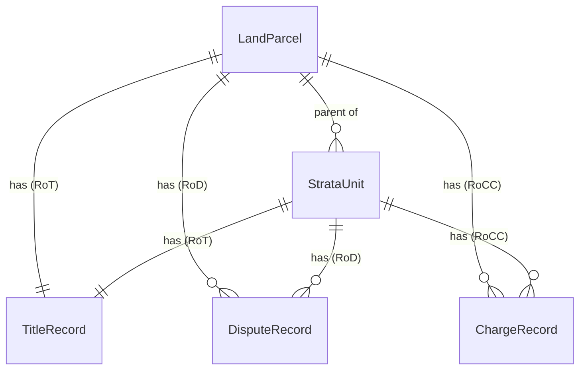
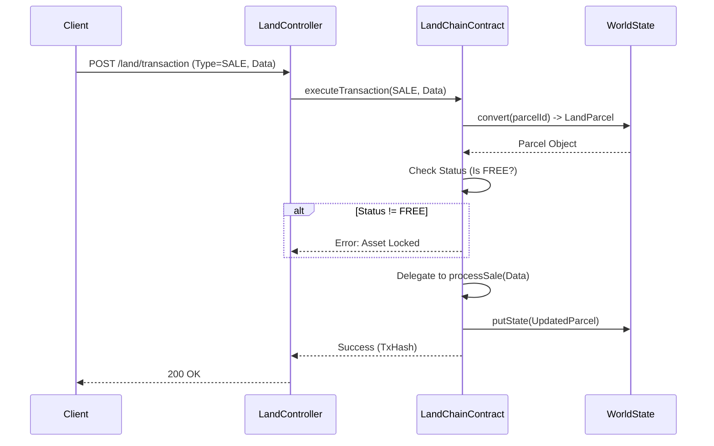
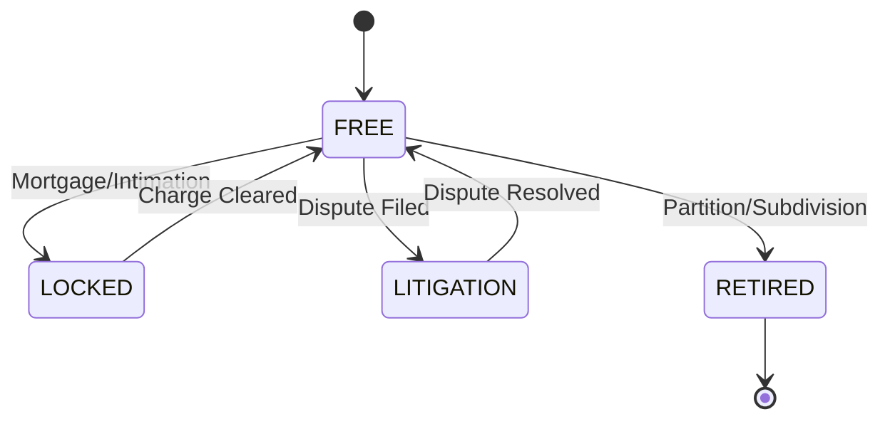

# LandChain Architecture: The "Model Act" Edition

## 1. Core Philosophy: The Three Registers
Aligned with **NITI Aayog's Model Conclusive Land Titling Act**, LandChain separates concerns into three distinct logical registers.

### A. Register of Titles (RoT)
- **Purpose**: Conclusive proof of ownership.
- **Conclusivity**: Entries become "indefeasible" after a 3-year statutory period (simulated).
- **Structure**: `TitleRecord` containing Owner Share % and `isConclusive` flag.

### B. Register of Disputes (RoD)
- **Purpose**: Tracks lis pendens (pending suits) and attachments.
- **Source**: Courts and Statutory Authorities via `Compulsory Intimation`.
- **Logic**: Any pending dispute blocks the `finalizeTitle` and `transferParcel` functions.

### C. Register of Charges and Covenants (RoCC)
- **Purpose**: Tracks encumbrances.
- **Source**: Banks (Mortgages), Municipalities (Tax), Rent controls.
- **Logic**: Active charges (Mortgage/Tax) block transfer until cleared.

## 2. Smart Contract Architecture

### The Composite Asset: `LandParcel` (Schema 2.0)
The `LandParcel` acts as the root aggregator for the three registers, now with dynamic state tracking.



```typescript
LandParcel {
  parcelId: string;
  surveyNo: string;
  subDivision: string; // e.g., "/1/A"
  landUse: 'AGRI' | 'NA' | 'IND' | 'FOREST';
  status: 'FREE' | 'LOCKED' | 'LITIGATION' | 'RETIRED'; // Dynamic Status
  title: TitleRecord;     // The RoT
  disputes: DisputeRecord[]; // The RoD
  charges: ChargeRecord[];   // The RoCC
}
```

### Strata Titling (Vertical Property)
For apartments and commercial units, we use `StrataUnit`.
- **Linked**: Contains `parentParcelId` linking to the Land.
- **Independent**: Has its own independent `RoT`, `RoD`, and `RoCC`.
- **UDS/Carpet Area**: Tracks Undivided Share of Land and verified area.

## 3. Pluggable Transaction Architecture (Phase 16)
To support infinite transaction types (Gift, Partition, Inheritance) without changing the core contract structure, we use a generic execution model.

### The `executeTransaction` Function
- **Input**: `TransactionType` (SALE/PARTITION/INHERITANCE), `DataPayload`, `EvidenceHash` (IPFS).
- **Core Logic**:
    1.  **State Check**: Is the asset `FREE`? (Global Lock Check).
    2.  **Logic Delegate**: Verification runs based on Type (e.g., Inheritance checks Heirship).
    3.  **State Transition**: Updates `RoT` (Title) or splits asset (Partition).
    4.  **Audit**: Emits `TransactionExecuted` event with evidence.

#### Transaction Flow



#### Lifecycle State Machine



## 4. Workflows

### A. Compulsory Intimation (The "Push" Model)
External entities (Courts, Banks) push data to the blockchain.
- **API**: `POST /land/intimation`
- **Effect**: Instantly locks the Land Parcel if the type is Blocking (e.g., Stay Order, Mortgage).

### B. Conclusive Title Transition
1.  **Notification**: Title is published (implicitly at creation/transfer).
2.  **Wait Period**: 3 Years (Simulated).
3.  **Finalization**: Owner calls `finalizeTitle`.
4.  **Checks**: Contract ensures `RoD` is empty.
5.  **Result**: Title becomes `Conclusive`. Government issues Indemnity.

## 4. Technology Stack
(Unchanged: Hyperledger Fabric v2.5, NestJS, Next.js)